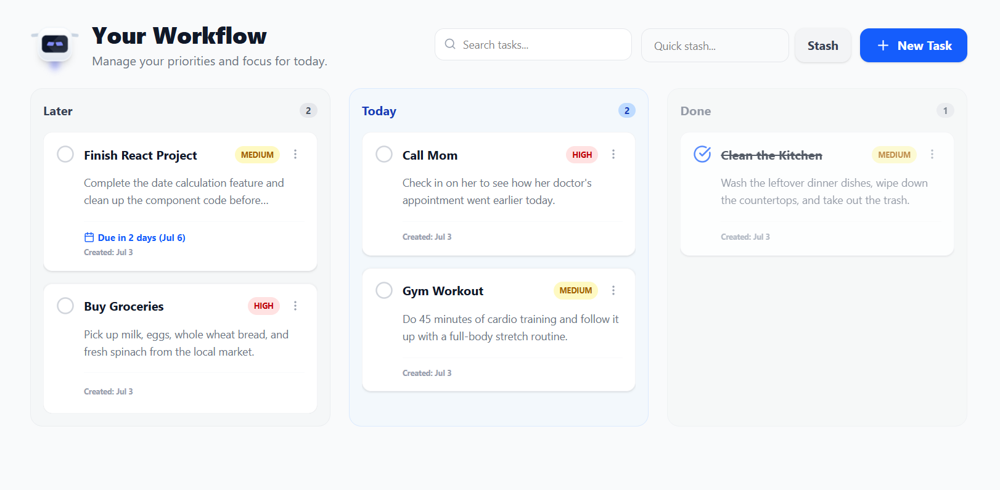

# ToDo App

A high-fidelity, emotion-aware task management app built on the MERN stack. Engineered to mitigate cognitive overload through a ruthless "Later, Today, Done" architecture and real-time behavioral feedback.

Developed by **Thaveesha Vithana**.



## Base
Traditional to-do applications function as infinite, anxiety-inducing backlogs. This workspace is designed like a flight deck. It physically limits active cognitive load, forces prioritization, and utilizes an animated companion node to provide real-time telemetry on user stress levels based on active task volume.

## Tech Stack
* **Frontend:** React.js, Tailwind CSS, Framer Motion, Lucide Icons.
* **Backend:** Node.js, Express.js.
* **Database:** MongoDB (Mongoose ORM).
* **Authentication:** JSON Web Tokens (JWT) in HTTP-only cookies, Google OAuth 2.0, Cloudflare Turnstile.
* **Infrastructure:** Nginx Reverse Proxy, PM2 Process Management.

## Security Architecture

This workspace employs a multi-layered, enterprise-grade security protocol:

1. **Bot Mitigation:** All unauthenticated entry points (Login, Register, Password Reset) are gated by **Cloudflare Turnstile**, preventing brute-force and credential-stuffing attacks.
2. **Stateless Authentication:** Successful logins generate a securely signed JWT. This token is **never** exposed to local storage; it is transmitted via strict HTTP-only, secure, SameSite cookies to mitigate XSS (Cross-Site Scripting) attacks.
3. **Cryptographic Storage:** Passwords are never stored in plaintext. They are salted and hashed utilizing `bcrypt` (Cost Factor 10) before database insertion.
4. **Time-Based Verification:** Password resets and sensitive profile mutations (email/password changes) require a 6-digit One-Time Password (OTP) dispatched via Nodemailer. The OTP is cryptographically hashed in the database and automatically self-destructs after 5 minutes utilizing MongoDB TTL (Time-To-Live) indexes.
5. **Self-Destruct Protocol:** Users maintain absolute data sovereignty. The profile settings feature a localized self-destruct mechanism that comprehensively wipes the user document, all associated tasks, and hanging OTPs from the database cluster instantly.

## Local Development Setup

### 1. Environment Variables
You can find a `.env.example` file in both `/client` and `/server` directory

*/Client*
- Create a `.env` file in the `/client` directory, **copy & paste** the details from `/client/.env.example`.

*/Server*
- Create a `.env` file in the `/server` directory, **copy & paste** the details from`/server/.env.example`.
- Manually enter the values for `EMAIL_USER` and `USER_PASS`. Values for them can't be provided even for development due to security reasons.


### 2. Installation and Execution
Open two terminal instances.

**Terminal 1 (Server)**
``` bash
cd server
npm install
npm run dev
```

**Terminal 2 (Client)**
``` bash
cd client
npm install
npm run dev
```

## Production Deployment Architecture (VPS)

This application is deployed on a Linux Virtual Private Server (VPS) utilizing a great web server architecture. The deployment strategy physically separates the static frontend from the Node.js API, utilizing Nginx as a reverse proxy.

### 1. DNS Configuration (Cloudflare)
To route traffic to the VPS without interfering with existing services on the root domain, a subdomain (todo.mk-printers.com.lk) was established via Cloudflare.
- A Record: Created an 'A' record mapping the `todo` hostname to the VPS's public IPv4 address.
- Proxy Status: Cloudflare Proxy was enabled to leverage Cloudflare's CDN, DDoS protection, and SSL termination before traffic ever reaches the origin server.

### 2. Frontend: Static Build
The React frontend is compiled into highly optimized static assets. These assets are served directly by Nginx, completely bypassing Node.js for static file delivery to ensure maximum performance.
```bash
cd client
npm run build
# The resulting /dist folder is placed at /var/www/todo/client/dist
```

### 3. Backend: Process Management (PM2)
The Node.js/Express API runs persistently in the background on port `5010`. It is managed by **PM2**, which ensures the application automatically restarts in the event of a crash or a server reboot.
```bash
cd server
npm install
pm2 start server.js --name "todo-api"
pm2 save
pm2 startup
```

### 4. Nginx Reverse Proxy Configuration
Nginx acts as the primary traffic controller. It intercepts incoming requests to the domain and routes them intelligently:
*   Root traffic (`/`) is directed to the React `dist` folder. The `try_files` directive ensures React Router handles client-side routing without throwing 404 errors.
*   API traffic (`/api/`) is reverse-proxied to the internal Node.js process running on port `5010`.

**Nginx Configuration Block (`/etc/nginx/sites-available/todo`):**
```nginx
   server {
       server_name todo.mk-printers.com.lk www.todo.mk-printers.com.lk;

       # Serve static React Frontend build files
       location / {
           root /var/www/todo/todo-mern/client/dist;
           index index.html index.htm;
           try_files $uri /index.html;
       }

       # Proxy API requests directly to the background Node.js service
       location /api/ {
           proxy_pass http://localhost:5010;
           proxy_http_version 1.1;
           proxy_set_header Upgrade $http_upgrade;
           proxy_set_header Connection 'upgrade';
           proxy_set_header Host $host;
           proxy_cache_bypass $http_upgrade;
           proxy_set_header X-Real-IP $remote_addr;
           proxy_set_header X-Forwarded-For $proxy_add_x_forwarded_for;
           proxy_set_header X-Forwarded-Proto $scheme;
       }

    listen 443 ssl; # managed by Certbot
    ssl_certificate /etc/letsencrypt/live/todo.mk-printers.com.lk/fullchain.pem; # managed by Certbot
    ssl_certificate_key /etc/letsencrypt/live/todo.mk-printers.com.lk/privkey.pem; # managed by Certbot
```

**Activation Commands:**
```bash
sudo ln -s /etc/nginx/sites-available/todo /etc/nginx/sites-enabled/
sudo nginx -t
sudo systemctl restart nginx
```

### 5. Security & SSL Setup
*   **Certbot (Let's Encrypt):** Used to generate SSL certificates and automatically update the Nginx configuration to force HTTPS redirection.
*   **Cloudflare DNS & SSL:** The domain utilizes Cloudflare's DNS. The SSL/TLS encryption mode is set to **"Full (Strict)"** to ensure an unbroken, end-to-end encrypted connection between the client, Cloudflare, and the Nginx origin server, preventing infinite redirect loops and Mixed Content errors.
